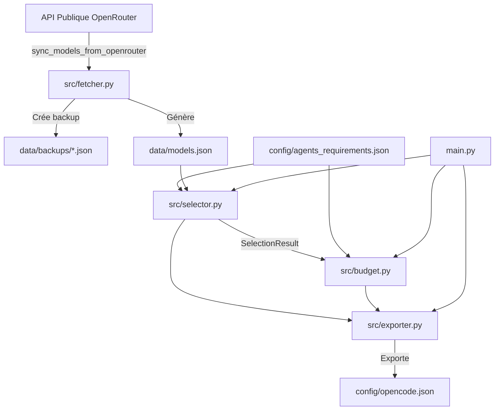

# Guide Multi-Agents : ModelScope 🤖

Ce document est le **point d'entrée pour tout agent IA** (Antigravity, Cursor, Claude Code, GitHub Copilot / Codex, Mistral / Codestral, Windsurf, OpenCode, Aider...) intervenant sur le dépôt. Il garantit la continuité opérationnelle, la cohérence des choix techniques et le respect des conventions établies.

---

## 1. Vue d'Ensemble & Objectif

**ModelScope** attribue automatiquement le modèle LLM optimal à chaque agent d'un parc **OpenCode** en fonction :
1. De contraintes techniques d'aptitude (complexité 1-5, support d'outils, taille de contexte minimale, compatibilité des fournisseurs).
2. De contraintes économiques (gratuité préférée, plafond budgétaire mensuel, détection des risques de quota).
3. D'un mécanisme de **surclassement économique (`fallback`)** en l'absence de correspondance stricte.

---

## 2. Flux de Données & Architecture



---

## 3. Checklist d'Onboarding pour Nouvel Agent

Lorsqu'un nouvel agent prend en main ce projet, il doit :
1. **Consulter les fichiers clés :**
   - [.cursorrules](file:///home/thomas/code/projets/ModelScope-Anti/modelscope-Anti/.cursorrules) : Directives strictes et conventions de code.
   - [config/agents_requirements.json](file:///home/thomas/code/projets/ModelScope-Anti/modelscope-Anti/config/agents_requirements.json) : Exigences déclarées pour les agents.
   - [src/selector.py](file:///home/thomas/code/projets/ModelScope-Anti/modelscope-Anti/src/selector.py) : Cœur logique pur de l'attribution.
2. **Exécuter la suite de tests pour vérifier l'intégrité :**
   ```bash
   python3 -m unittest discover tests
   ```
   *Tous les tests (actuellement 24) doivent être au vert.*
3. **Tester l'exécution principale :**
   ```bash
   python3 main.py --export
   ```

---

## 4. Composants & Responsabilités

| Module / Fichier | Responsabilité Principale | Contraintes Particulières |
|---|---|---|
| [`src/selector.py`](file:///home/thomas/code/projets/ModelScope-Anti/modelscope-Anti/src/selector.py) | Filtrage, tri, sélection et surclassement | **Fonctions pures uniquement**. Aucun appel I/O ou réseau. |
| [`src/fetcher.py`](file:///home/thomas/code/projets/ModelScope-Anti/modelscope-Anti/src/fetcher.py) | Récupération OpenRouter & scoring heuristique | Toujours appeler `create_backup()` avant d'écraser `data/models.json`. |
| [`src/budget.py`](file:///home/thomas/code/projets/ModelScope-Anti/modelscope-Anti/src/budget.py) | Calcul des coûts au token & alertes de quotas | Seuil critique free-tier : `1_000_000` tokens/mois. |
| [`src/exporter.py`](file:///home/thomas/code/projets/ModelScope-Anti/modelscope-Anti/src/exporter.py) | Génération du JSON pour OpenCode | Structure immuable avec `metadata`, `budget_simulation` et `agents`. |
| [`main.py`](file:///home/thomas/code/projets/ModelScope-Anti/modelscope-Anti/main.py) | Interface CLI en ligne de commande | Supporte `--sync`, `--export [path]`, `--no-fallback`. |

---

## 5. État Actuel du Projet & Historique des Jalons

- ✅ **Jalon 1 (MVP) :** Structures `Model` et `AgentRequirement`, filtrage des outils et complexité, priorisation du gratuit.
- ✅ **Jalon 2 (Catalogue & Fallback) :** Intégration de modèles légers (scores 1-2), logique de surclassement (`fallback`) et tests de compatibilité.
- ✅ **Jalon 3 (Sync OpenRouter & Backups) :** Téléchargement dynamique via l'API OpenRouter, filtrage des tarifs négatifs, backups horodatés dans `data/backups/`.
- ✅ **Jalon 4 (Export OpenCode) :** Module d'export standardisé générant `config/opencode.json`.
- ✅ **Jalon 5 (Filtres Avancés) :** `min_context_window`, `allowed_providers`, `excluded_providers`, `force_model`.
- ✅ **Jalon 6 (Simulation Budgétaire) :** Calculs de coût mensuel au token, alertes de quotas free-tier, gestion du `max_monthly_budget`.

---

## 6. Prochaines Étapes Recommandées (Roadmap)

Si le projet doit continuer d'évoluer, les tâches prioritaires suivantes sont identifiées :
1. **Packaging & Dépendances :** Créer `pyproject.toml` ou `requirements.txt` avec support optionnel de `pytest`, `ruff` et `mypy`.
2. **CI/CD GitHub Actions :** Workflow pour exécuter automatiquement les tests unitaires à chaque push / PR.
3. **Automatisation de la veille de modèles :** Cron GitHub Actions (ou tâche planifiée) pour mettre à jour `data/models.json` chaque semaine depuis OpenRouter.
4. **Gestion multi-sources :** Permettre d'agréger d'autres sources de modèles (ex: Ollama pour les modèles 100% locaux hors-ligne, AWS Bedrock, etc.).

---

## 7. Règle d'Or pour Chaque Intervention

> **Ne proposez jamais de commit sans avoir créé ou mis à jour les tests unitaires correspondants dans `tests/` et sans avoir vérifié que `python3 -m unittest discover tests` s'exécute avec succès.**
